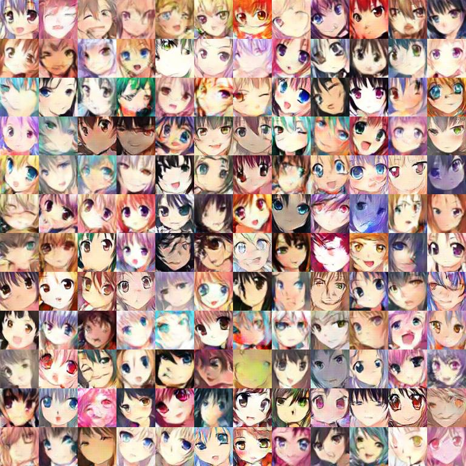
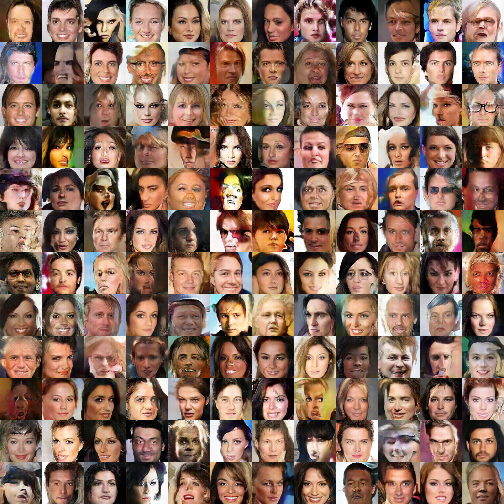
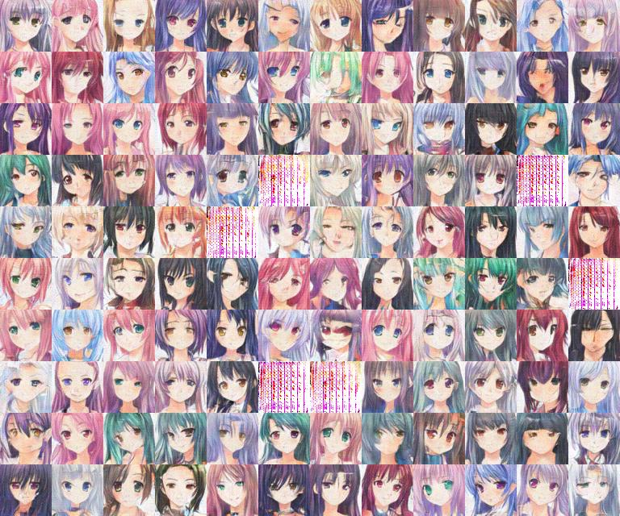

# Generative Adversial Network Practice

### Goals
Learn and implement three types of GAN applications and other computer vision tasks

1. Unconditional GAN
2. Conditional GAN 
3. Style Transfer (Coming Soon)

### Workflow
#### Create tfrecord data file
You will have to created the tfrecord file using the raw data, including images and labels. You will also have to convert the labels into one-hot format if they're not. The tfrecord file will only have to created once, though it take some time and space to create.
```code
 # set create_tfrecord to True in main.py 
```

#### Running the program
```
# Check and change the hyper parameters in main.py before training or testing everytime
python3 main.py
```

### Results
####Unconditional Gan





####Conditional 



####Style Transfer
Will be here soon

### Other
1. Unconditional Gan is based on wgan-gp; however, it seems like there's still some issue about mode collapse or dead pixels

2. Conditional Gan is based on the DRAGAN, but it doesn't seems to learn the labels. More training might be helpful since I have only trained like 20000 epochs.(more than 8 hours on my GTX 1080Ti FTW-DT actually) The label problem might also be a result of unbalanced or scarcity of some labels. Some data augementation might also help too.

3. Style Transfer would be implemented with STARGAN and I am still working on it.

4. I am aiming to make this project more flexible in a sense that it will work on different datasets. At least the celeb and anime character dataset will be supported in close future